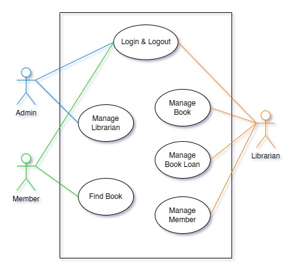

# Go Library Backend
REST API app for library management using Go and MySQL. This app, is purposed to make it easier for librarians to manage book loans.

## Contents
- [How to install (using Go)](#how-to-install-using-go)
- [How to install (using Docker)](#how-to-install-using-docker)
- [Usecase diagram](#usecase-diagram)
- [ERD and database](#erd-and-database)
- [Packages used](#packages-used)
- [API documentation](#api-documentation)
- [Login credentials](#login-credentials)
- [Logging](#logging)
- [Unit test](#unit-test)
- [Manual test](#manual-test)

---

## How to install (using Go)
```Requirement: Go Programming Language, Golang Migrate, & MySQL```

1. Clone this repository
```sh
git clone https://github.com/hasyimzii/go_library_backend.git
```
2. Open repository in terminal
```sh
cd go_library_backend
```
3. Open MySQL & make database
```sql
CREATE DATABASE go_library_backend;
```
4. Run migrations
```sh
# TODO: run migration
```
5. Build Go app
```go
go build
```
6. Excecute binary file
```sh
./go_library_backend
```
7. Now the app is running

## How to install (using Docker)
```Requirement: Docker```

1. Clone this repository
```sh
git clone https://github.com/hasyimzii/go_library_backend.git
```
2. Open repository in terminal
```sh
cd go_library_backend
```
3. Excecute docker compose command
```sh
docker composer up -d
```
4. Now the code is running
5. (If you want to remove the container, image, & volumes) 
```sh
docker compose down
docker image rm go_library_backend:1.0.0
docker volume rm go_library_backend_logs
```

---

## Usecase diagram


In this app, there are 3 actors:
- Admin : User who has access to manage librarian
- Librarian : User who has access to manage book, borrowing, and member
- Member : User who has acces to find book by name or category

## ERD and database


## Packages used

## API documentation

## Login credentials

## Logging

## Unit test
(Must've installed: Go Programming Language)

## Manual test
(If using VSCode, must've extension: REST Client by Huachao Mao)